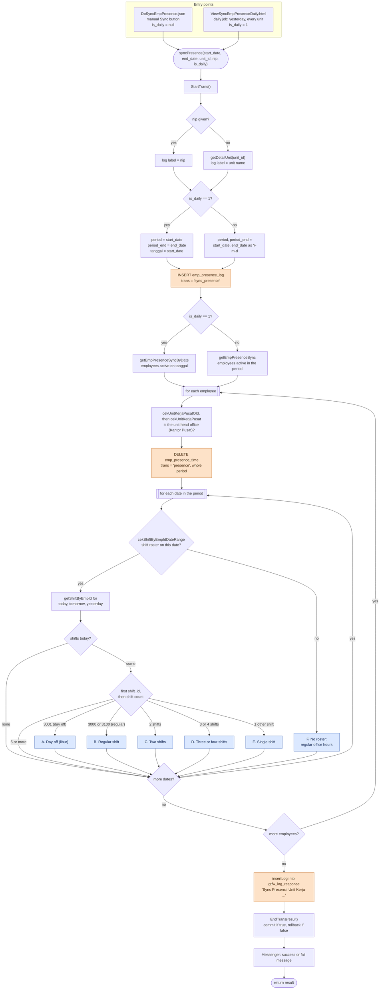
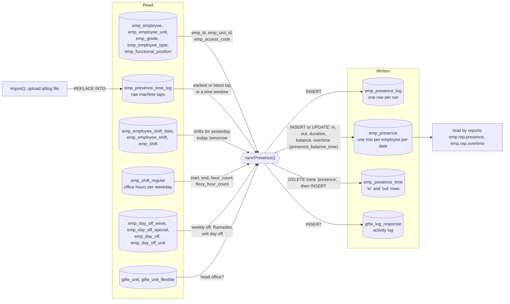
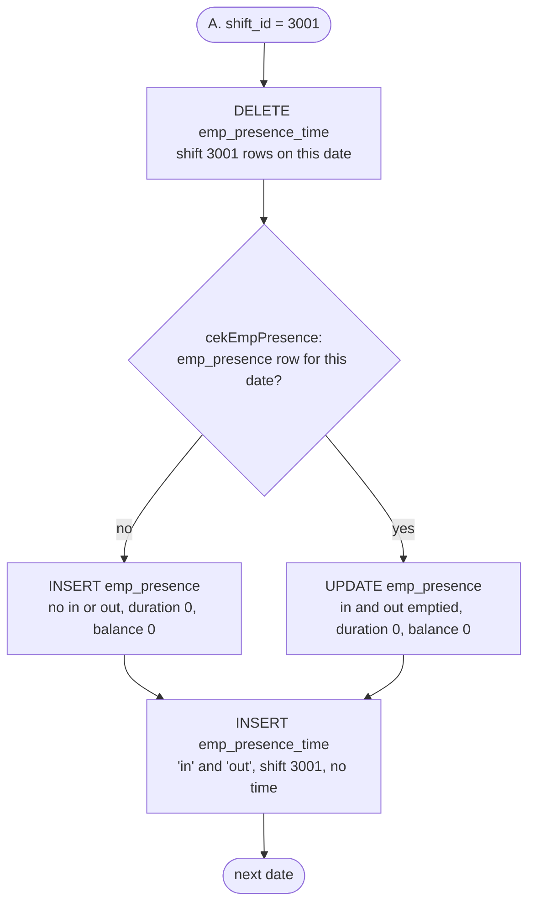
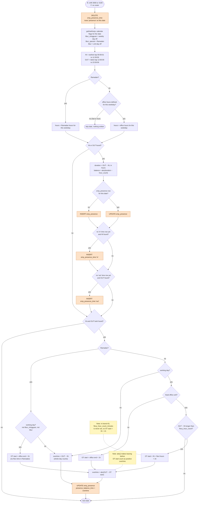
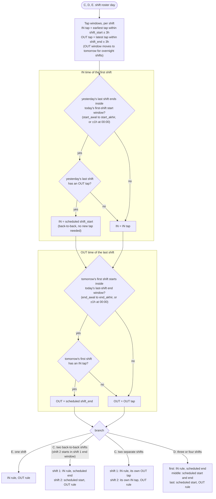
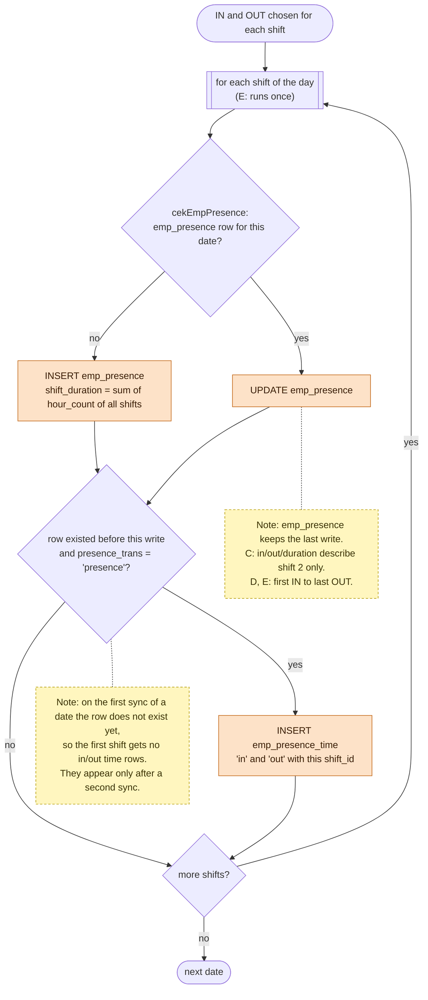

# syncPresence() flowchart

Source: `module/emp.presence/response/ProcessEmpPresence.proc.class.php`, `syncPresence()` (lines 113–1794).

The function turns raw machine taps (`emp_presence_time_log`) into one `emp_presence` row per employee per date, plus `in`/`out` rows in `emp_presence_time`. Each day takes one of six branches (A–F), depending on the employee's shift roster for that date.

Diagrams:

1. Overview: entry points, loops, branch dispatch, commit
2. Data flow: which tables are read and written
3. Branch A: day off (shift 3001)
4. Branches B and F: regular office hours, including overtime
5. Branches C, D, E: shift rosters (1–4 shifts per day)

---

## 1. Overview

---

## 2. Data flow (tables)

Machine taps are matched to employees by `emp_employee.emp_access_code = emp_presence_time_log.presencetimelog_nip`.

---

## 3. Branch A: day off (shift 3001)

---

## 4. Branches B and F: regular office hours

B is a roster day with shift 3000 or 3100. F is a day with no roster at all. Both run the same logic. The differences are listed under the diagram.

B vs F:

| | B (shift 3000/3100) | F (no roster) |
|---|---|---|
| `presencetime_shift_id` written | 3000 or 3100 | NULL |
| `flexy_hour_count_minutes` | never set, so treated as 0 | `flexy_hour_count × 60` |
| Calendar flags come from | `$detail_shift_reguler[0]` | `$value_date` (loop over `getHariKerja`) |

---

## 5. Branches C, D, E: shift rosters

Part 1 shows how each shift's IN and OUT times are chosen. Part 2 shows how they are written.

---

## Notes from tracing the code

These are not drawn above, but they affect the data:

1. **Shift branches skip time rows on the first sync** (lines 795, 976, 1167, 1355, 1554). `$presence` is looked up before the insert, so for a new date it is null and `$presence['presence_trans'] == 'presence'` is false.
2. **Overtime uses `abs()`** (lines 382, 409, 420 and the same lines in the other branches). If OUT is earlier than OT start, the difference is still stored as positive overtime. Example: office end 16:00, OUT 16:00, non-head-office: OT start = 17:00, overtime = 1h. `emp.rep.overtime` reads this column directly.
3. **Branch B head office overtime** (lines 408, 599). `flexy_hour_count_minutes` is only computed in branch F (lines 1608, 1617), so B shifts OT start by 1h instead of flexi hours + 1h.
4. **Days with only one tap.** If only IN or only OUT is found, `strtotime(null)` returns `false` (0), so `duration = abs(OUT − IN)` is measured from Unix time 0, about 497,000 hours. `presence_balance` is affected the same way. What gets stored depends on the column type and SQL mode.
5. **`$result = ...` instead of `$result = $result && ...`** in branches A, B and F (for example lines 196, 310, 352, 388, 1646). A later success overwrites an earlier failure. ADOdb's `CompleteTrans` still rolls back on SQL errors, so the data stays safe, but the function can return `true` and show "success" for a sync that was rolled back.
6. **Four-shift days** (line 1221 onwards). Only index 3 (last) and index 1 (middle) have their own case. Index 2 falls into the first-shift `else`, so shift 3 is written with shift 1's times.
7. **Five or more shifts** in a day match no branch and are skipped silently.
